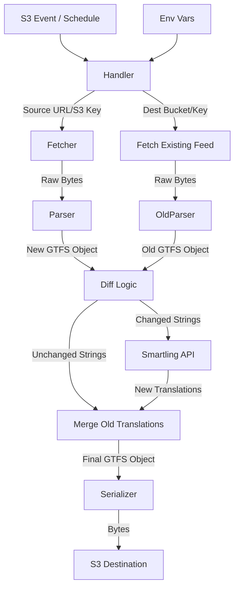

# Create GTFS-RT ServiceAlerts Translation Lambda

## Overview

We need to build a new AWS Lambda function that translates GTFS-Realtime ServiceAlerts feeds from English into multiple target languages using the Smartling API. The system must support both "Pull" (scheduled fetch) and "Push" (S3 event trigger) modes, and rigorously preserve the input format (JSON or Protobuf).

## Problem Statement

Transit alerts are currently often provided only in English. To improve accessibility for all riders, we need an automated pipeline that intercepts these alerts, translates the `header_text` and `description_text`, and publishes a multilingual feed.

## Proposed Solution

We will build a Python-based Lambda function using the "Typed GTFS Processor" pattern. This ensures data integrity by deserializing the feed into strict Python objects before manipulation.

### Key Components

1.  **Lambda Entry Point (`main.py`)**: Handles the "Event-Aware Config-Driven" logic to determine the input source.
2.  **Feed Processor (`processor.py`)**: Handles parsing (JSON/PB), traversing the GTFS entities, and re-serializing.
3.  **Translation Service (`translator.py`)**: An abstract interface with a specific `SmartlingTranslator` implementation.

## Technical Approach

### Architecture

### Implementation Phases

#### Phase 1: Core Domain Logic (Local)
- Set up Python project with `poetry`.
- Implement `FeedProcessor` to parse and serialize both JSON and Protobuf.
- **Implement Diff/Merge Logic:** Create a component that compares a "New" feed against an "Old" feed, preserving translations where the English text (and Entity ID) matches.
- Create a `MockTranslator` to prove the traversal logic works without hitting external APIs.
- **Deliverable:** A script that reads a local GTFS file, compares it to a previous version, and only "translates" (mocks) changed text.

#### Phase 2: Smartling Integration & Async
- Implement `SmartlingTranslator` using `httpx` for **async** I/O.
- Implement Smartling Auth Token caching (module-level variable for Lambda warm starts).
- **Deliverable:** Async translation handling with real credentials.

#### Phase 3: Lambda Handler & AWS Integration
- Implement the "Event-Aware" handler logic.
- Implement **Read-before-Write** logic: Fetch the existing destination file (handling 404s) to serve as the "Old" comparison feed.
- Implement S3 uploading.
- **Deliverable:** Deployable Lambda handler code.

## Acceptance Criteria

### Functional Requirements
- [ ] **Input Format:** Must automatically detect and support both GTFS-RT Protobuf and JSON.
- [ ] **Output Format:** Output file must strictly match the input format (Input PB -> Output PB).
- [ ] **Smart Caching:**
    - [ ] Must fetch the *current* output file (if it exists) before processing.
    - [ ] If an Alert's `header_text` or `description_text` matches the existing file exactly, **do not** call Smartling; preserve the existing translations.
    - [ ] Only call Smartling for new or modified English text.
- [ ] **Translation:** Must translate `header_text` and `description_text` for all Alert entities.
    - [ ] Must also translate `tts_header_text` and `tts_description_text` if they are present.
    - [ ] **URL Handling:** For `url` fields, do not use Smartling. Instead, append `?locale={lang}` (or `&locale={lang}`) to the English URL for each target language.
        - [ ] If the URL already contains a `locale` parameter, do not modify it.
- [ ] **Triggers:**
    - [ ] If triggered by Schedule: Fetch from `SOURCE_URL`.
    - [ ] If triggered by S3 Event: Fetch from the bucket/key in the event.
- [ ] **Languages:** Must support multiple target languages defined in `TARGET_LANGUAGES` (e.g., "es,fr").

### Non-Functional Requirements
- [ ] **Concurrency:** Use `asyncio` and `httpx` to perform translation requests concurrently, preventing timeout issues on large feeds.
- [ ] **Resilience:** If Smartling fails, the Lambda should fail loudly (retry via standard AWS Lambda retry policies) rather than outputting partial data.
- [ ] **Idempotency:** Re-running the function on the same input should produce the same output (and cost $0 in translation fees due to the diff logic).
- [ ] **Safety:** Output destination must be explicitly configured to avoid S3 recursion loops (e.g., separate bucket or key prefix).

## Technical Considerations

- **Library:** `gtfs-realtime-bindings` (Python) for Protobuf handling.
- **Async HTTP:** Use `httpx` or `aiohttp` for async Smartling API calls.
- **Smartling API:** Use the **Machine Translation API** (synchronous).
  - Endpoint: `POST /machine-translation/v2/accounts/{accountUid}/locales/{localeId}/translate`
  - Auth: Bearer Token (requires strict token management/refresh flow). Cache this token.
- **Environment Variables:**
  - `SMARTLING_USER_ID`
  - `SMARTLING_USER_SECRET`
  - `SMARTLING_PROJECT_ID`
  - `SOURCE_URL`
  - `DESTINATION_BUCKET_URL`
  - `TARGET_LANGUAGES`

## References

- **Brainstorm:** `docs/brainstorms/2026-02-03-gtfs-alerts-translation-lambda-brainstorm.md`
- **Smartling API:** [Machine Translation Operation](https://api-reference.smartling.com/#tag/Machine-Translation-(MT)/operation/translateForAccount)
